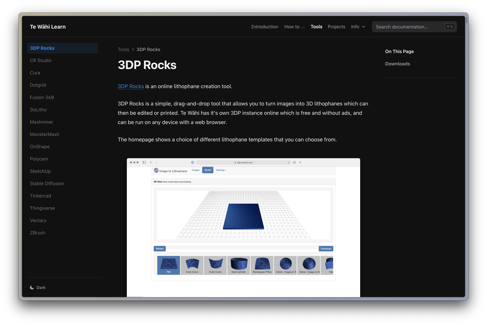

# Te Wāhi Learn

This is an online hub created with [Nextra](https://nextra.site).

It uses [Tina](https://tina.io) as a headless CMS to manage content. The ability to support native Nextra components such as Callouts is still in development.

## Deploy your own

Click the button to clone this repository and deploy it on Vercel:

## Local Development

First, run `pnpm i` to install the dependencies.

Then, run `pnpm dev` to start the development server and visit localhost:3000.

## License

This project is licensed under the MIT License.
